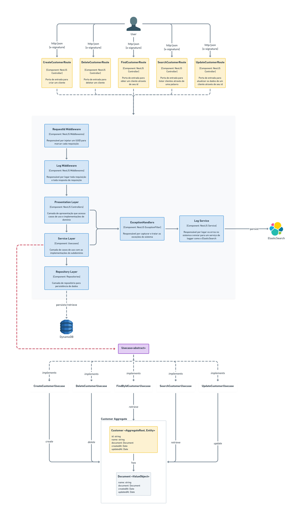

# Customer API

This is a simple REST API for managing customer data. It allows you to create, read, update, and delete customer records.

The application was build using the following technologies:

- NestJS
- Serverless Framework
- AWS Lambda
- DynamoDB

## Application Architecture

The application is designed to be serverless, meaning it runs on AWS Lambda and uses DynamoDB for data storage. The both application level 3 and level 4 C4 model is as follows:



## API Endpoints

The API has the following endpoints:

- `POST /customers` - Create a new customer
- `GET /customers/{id}` - Get a customer by ID
- `PUT /customers/{id}` - Update a customer by ID
- `DELETE /customers/{id}` - Delete a customer by ID
- `GET /customers?keyword={{keyword}}&page={{page}}&size={{size}}&lastId={{lastId}}` - Get a list of all customers that has the keyword in any of the fields. The pagination is done using the `lastId` parameter. The `page` and `size` parameters are used to control the number of items returned in the response.

## Getting Started

After cloning this repository, ensure that [Node.js](https://nodejs.org/en), [npm](https://nodejs.org/en/learn/getting-started/an-introduction-to-the-npm-package-manager), [serverless framework](https://www.serverless.com/) and [Docker](https://www.docker.com/) are installed on your system. Then, follow these steps to run the application locally:

1 ) Run dynamodb locally using docker:

```bash
docker-compose -f docker-compose.development.yaml up -d
```

2 ) Install the dependencies:

```bash
npm install
```

3 ) Build the application:

```bash
npm run build
```

4 ) Run the application locally:

```bash
npx serverless offline
```

You can test the API using the VSCode REST Client extension and the .http files provided into the `.http` folder. You can also use Postman or any other API testing tool.

## Running Tests

To run all the tests, use the following command:

```bash
npm run test
```

If you want to run only the unity tests, use the following command:

```bash
npm run test:unit
```

If you want to run only the integration tests, use the following command:

```bash
npm run test:integration
```

## API Documentation

The API documentation is available. It was generated using [Swagger](https://swagger.io/) and can be accessed at the following URL:

```bash
http://localhost:3000/dev/api
```

## Not Implemented

### x-signature header validation

The header `x-signature` validation is not implemented. This is a custom header that should be used to validate the request. The validation should be done using a secret key that is shared between the client and the server through a nestjs middleware. This secret key could be stored in AWS Secrets Manager. The client should sign the request using the secret key and the server should validate the signature using the same key. This is not implemented in this version of the API.

### Elastic Search

The API is not sending logs to Elastic Search. The logs should be sent to Elastic Search using the injected `requestId` as index. This way we can search the logs using the requestId which facilitates for distributed tracing. This is not implemented in this version of the API.

## About the Author

Hello! How are you? My name is José Eurípedes, I am 37 years old, and I hold a PhD in Computer Science. I wrote my first lines of code at the age of 13, and today I have a great passion for teaching everything I have learned throughout my 24 years of experience.

You can find me on the following platforms:

- [YouTube](https://www.youtube.com/@doutorwaka)
- [Instagram](https://instagram.com/doutorwaka)
- [TikTok](https://www.tiktok.com/@doutorwaka)
- [Website](https://www.doutorwaka.com/)
